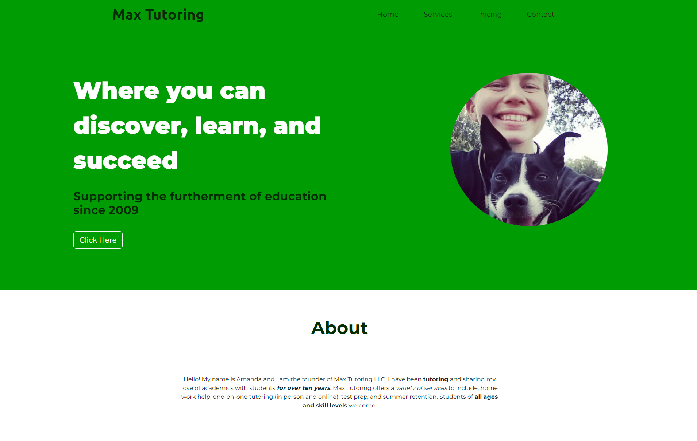

# Website for Max Tutoring

Two things that really stretched me in this build was getting all of the alignment correct and the form at the bottom. Generally an HTML form is unable to automatically send form data via email without using a PHP or Ruby script (and without the information being publicly visible), but by using a service called formsubmit.co now form data is automatically submitted to her email address, solving a problem she had previously in following up with website contacts.

# Live preview: https://asvirts.github.io/max-tutoring/
